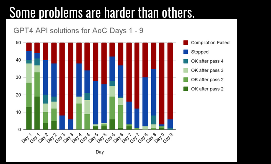

# How to make ChatGPT generate Code

This is a study and proof of concept to facilitate ChatGPT to write code using __AI Automated Test Drive Development__.

The idea is to give ChatGPT three inputs into the API:

1. A reference test module
2. An implementation module
3. The result of running the test against the implementation result

And then ask ChatGPT to produce an updated implementation, and keep doing this in a loop.

## Slides

This work was presented at [Elixir.berlin on January 11th](https://www.meetup.com/de-DE/elixir-berlin/events/298047006/)

[](https://docs.google.com/presentation/d/1hfWRqhDt-qHB8VpK_sV37RDh3gMZOjlGXXtuVWz2f74/edit#slide=id.g2adbb69df5c_0_24/)

## API Key

In order to run this you have to have an openapi API KEY, and put it into the environment as `OPENAI_API_KEY`

For example:

```bash
export OPENAI_API_KEY=xxxxxxx
```

## Generate the score

The scoring used in the slide graphs is generated using the `gpt.exs score` command. E.g. to generate 50 new solutions and retry up to four iterations on each solution: 

`./gpt.exs score day1 50 4`


## Fix the code to pass the test

The `./gpt.exs test <module> <iteration>` command will run the test and ask ChatGPT
for code improvements. It will keep doing this up to <iterations> in a loop.

```bash
export OPENAI_API_KEY=xxxxxxx
./gpt.exs test day1 4
```

## Update the code according to my instruction

The `./gpt.exs update <module> <instructions ...>` command will ask ChatGPT to make
changes to the code according to the provided instruction

```bash
export OPENAI_API_KEY=xxxxxxx
./gpt.exs update day1 remove the moduledoc
```
